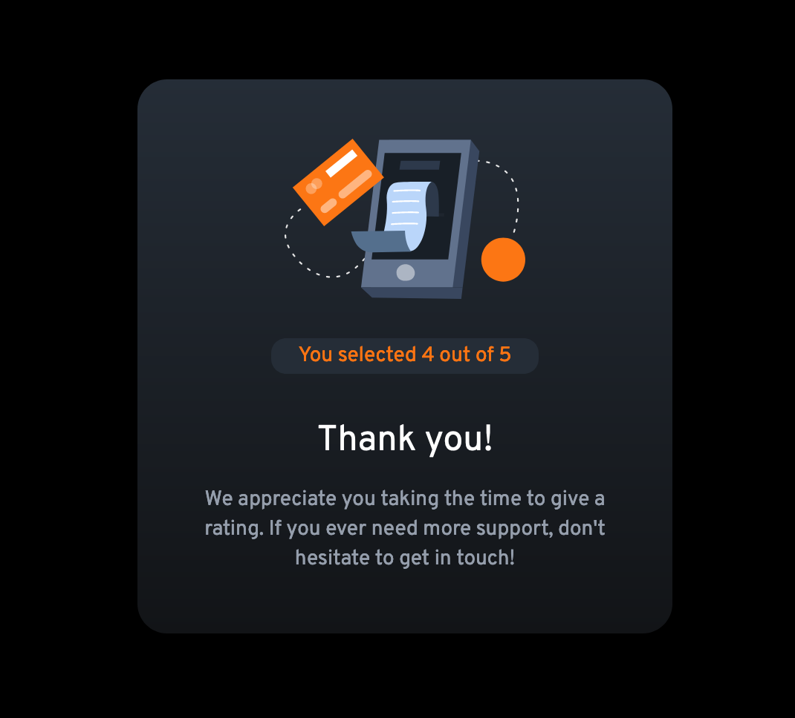

#  Interactive rating component solution

Interactive Rating Component

## Table of contents

- [Overview](#overview)
  - [The challenge](#the-challenge)
  - [Screenshot](#screenshot)
  - [Links](#links)
- [My process](#my-process)
  - [Built with](#built-with)
  - [What I learned](#what-i-learned)
  - [Continued development](#continued-development)
  - [Useful resources](#useful-resources)
- [Author](#author)
- [Acknowledgments](#acknowledgments)

## Overview

### The challenge

Users should be able to:

- View the optimal layout for the app depending on their device's screen size
- See hover states for all interactive elements on the page
- Select and submit a number rating
- See the "Thank you" card state after submitting a rating

### Screenshot

### Links

- Solution URL: [Add solution URL here](https://your-solution-url.com)
- Live Site URL: [Add live site URL here](https://your-live-site-url.com)

## My process

### Built with

- Semantic HTML5 markup
- CSS custom properties
- Flexbox
- CSS Grid

### What I learned

This project allowed me to get more practice with Javascript and DOM manipulation. 

### Continued development

I want to continue learning how to manipulate the DOM and the classList in order to figure out the limitations and the benefits of using this method. 

### Useful resources

- [StackOverflow](https://www.stackoverflow.com) - Various threads helped me refine the DOM manipulation.

- [FreeCodeCamp](https://www.freecodecamp.com) - Various articles on the platform assisted me with working the DOM manipulation. 

- [MDN Web Docs](https://developer.mozilla.org/en-US/docs/Web/API/DOMTokenList/) - Documentation around the site and this linked page assisted me with figuring out methods to manipulate the DOM in this project. 

## Author

- See Paula Code - [Paula](https://www.seepaulacode.me)
- Github - [Github](https://www.github.com/thedoodlebakery)
